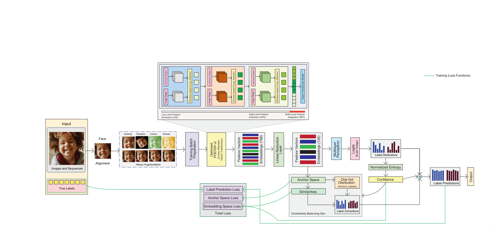

# CAFEL: Confidence-Aware Uncertainty Balancing for Robust Facial Expression Learning
## Authors: Raima Islam, Azmine Toushik Wasi, Taki Hasan Rafi, Ahnaf Tahmid Saad, Dong-Kyu Chae

## Architecture
Modified POSTER_V2 followed by anchor label correction network.
<p align="center">
  
</p>

## Results
Results on AffWild2 dataset.
| Method   | F1   |
| POSTER++ | 0.31 |
| CFER     | 0.35 |

## Setup and run
Put pretrained `ir50.pth` and `mobilefacenet.pth` into `cfer/models/pretrained`.
By default, data is assumed to be in `../../_DATA`.
To change the default paths, change `DIR_IMG`, `DIR_ANN_TRAIN`, `DIR_ANN_DEV` in `cfer/config.py`
To install the dependencies run:
```
pip install -r requirements.txt
```
To run the training script:
```
python train.py
```

## References
[POSTER_V2](https://github.com/talented-q/poster_v2) \
[ViT](https://github.com/huggingface/pytorch-image-models)
